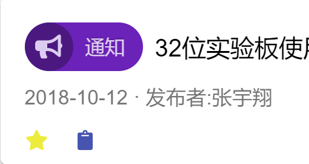
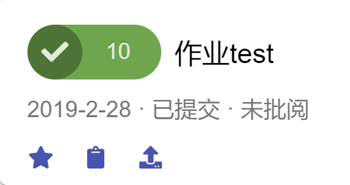
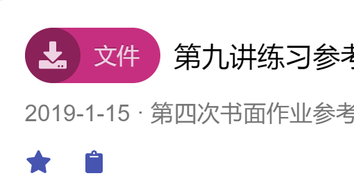
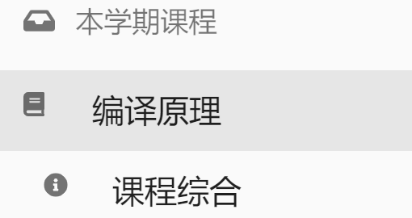
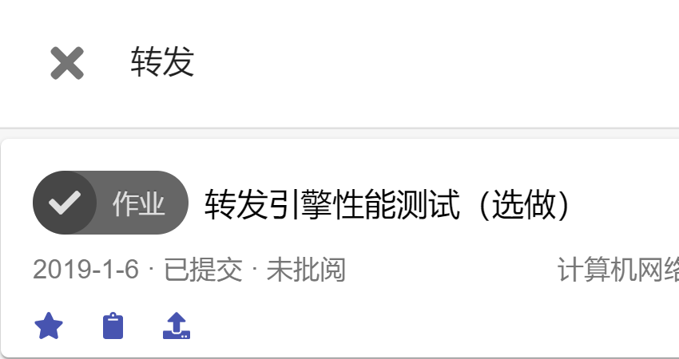
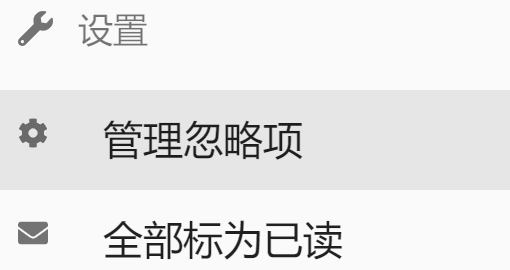

import styles from '../../../css/doc.module.css';

# Manual

  
  

    ## New item
    New items will appear at the top of the list, with a red dot indicating unread. This is a new homework, labeled with the number of days remaining.
  

  
  

    ## Starred item
    Starred items will always remain at the top of the list. This is a starred notification, click to see its details.
  

  
  

    ## Homework
    There are three colors: red, orange, and blue indicating the remaining time, and a submit button in the lower left corner. Homeworks that are submitted is marked with a green tick.
  

  
  

    ## Expired homework
    Homeworks that have passed the deadline will become grey, and display the score and the reviewer if graded.
  

  
  

    ## File
    Click on the title to download the file, or directly mark it as read (not synchronized to Web Learning).
  

  
  

    ## Switch content
    Switch to view the overview panel of different type of items, with the corner mark showing unread count.
  

  
  

    ## Switch course
    Click on the course name on the left to view the contents of the course, or open the course homepage on Web Learning.
  

  
  

    ## Filter
    Use filters to easily find the one you want among hundreds or thousands of items.
  

  
  

    ## Extension settings
    You can hide part of the content of some courses. And we also thoughtfully provide a one-click function to mark everying as read.
  

  
  

    ## Other settings
    If you encounter an error, try refreshing, clearing data or logging out.
  

